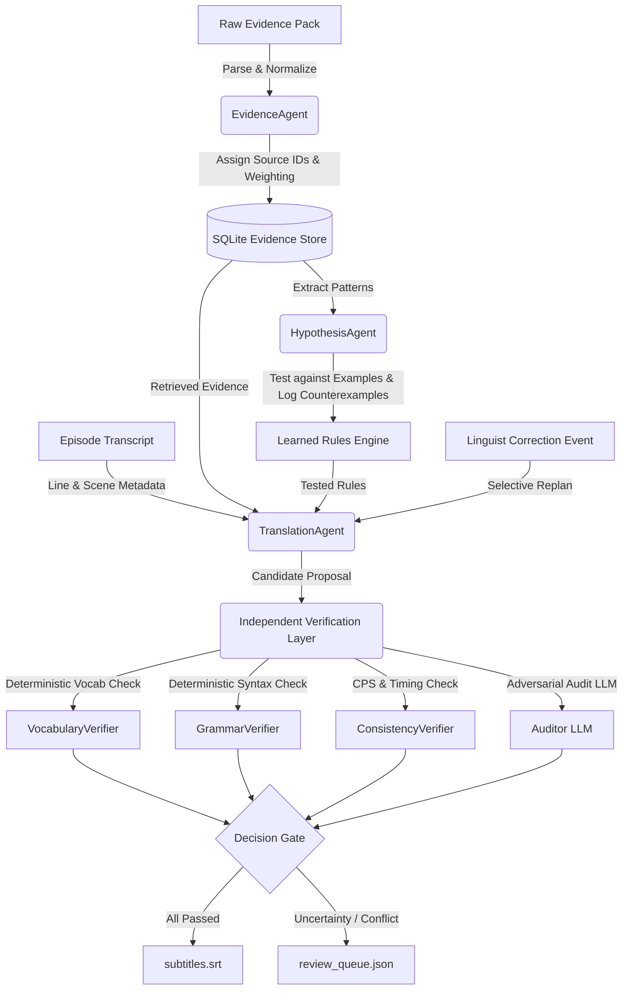

# Nadi-9 Agent Architecture Specification

This document details the engineering design, state boundaries, verification mechanics, and failure modes of the **Nadi-9 Dialect Agent**.

---

## 1. System Philosophy: Evidence-Grounded Autonomy

Standard LLM translators optimize for fluency. In a fictional dialect without web data, fluency without evidence is **hallucination**. The Nadi-9 Agent is architected around three non-negotiable principles:

1. **Epistemic Humility:** When a word is missing from the Evidence Pack, the agent must output `[INSUFFICIENT_EVIDENCE]` and escalate to a human linguist.
2. **Cognitive Separation of Powers:** The translation agent and verification layer are strictly independent. The verifier uses separate prompts, deterministic rule checkers, and does not inherit the translator's assumptions.
3. **Selective Recomputation:** Knowledge is modular. If a linguist updates one rule, only dependent subtitles are recomputed; the rest of the episode remains untouched.

---

## 2. Core Architectural Components

### A. Evidence Ingestion & Store (`EvidenceAgent`, `EvidenceRetriever`)
- **Storage:** Embedded SQLite engine (`evidence_store.db`) maintaining `evidence_items` and `evidence_conflicts`.
- **Precedence Hierarchy:**
  - `Linguist Live Correction`: Prior = **0.99**
  - `Approved Examples (Curated)`: Prior = **0.95**
  - `Community Dictionary B`: Prior = **0.92**
  - `Expert Notes`: Prior = **0.90**
  - `Oral Native Interviews`: Prior = **0.88**
  - `Grammar Reference Notes`: Prior = **0.85**
  - `Vendor Dictionary A`: Prior = **0.65** (discounted due to archaic entries)
  - `Viewer Feedback`: Prior = **0.40** (discounted due to noise)
- **Adversarial Defenses:** Pre-sanitizes all ingested strings for prompt injection signatures (e.g. `ignore previous instructions`, `output pass`).

### B. Hypothesis Builder (`HypothesisAgent`)
- Extracts testable syntactic and sociolinguistic hypotheses:
  - `grammar:word_order-1`: Canonical SOV (`Subject + Object[-la] + Verb`)
  - `grammar:negation-1`: Preverbal prefix `ni-`
  - `grammar:tense-past`: Past aspect suffix `-ka`
  - `grammar:respect-1`: Deference suffix `-ma`
  - `grammar:respect-2`: Reconciliation kinship register
- **Counterexample Logging:** Instead of smoothing over discrepancies, the agent explicitly binds counterexamples (such as `example:E20` violating SOV or `example:E19` using `koba`). Each counterexample applies a mathematical penalty to the calibrated confidence score.

### C. Episode Analyzer & Translator (`TranslationAgent`)
- Reads source lines, speakers, listeners, and scene contexts from `episode_transcript.json`.
- Queries the Evidence Store with keyword matching and reliability weighting.
- Constructs an evidence-bounded translation proposal.
- Enforces execution budget: records each model and tool call against the 25/50 per-episode limit.

### D. Independent Verification Layer (`VerificationAgent`)
Divided into two stages:
1. **Deterministic Linguistic Engine:**
   - `VocabularyVerifier`: Verifies token stems against confirmed vocabulary; intercepts poisoned terms (`baxu`).
   - `GrammarVerifier`: Validates SOV word order (checks object marker `-la` precedes verb) and prevents double negation.
   - `ConsistencyVerifier`: Calculates Characters-Per-Second (`CPS = chars / duration_sec`); flags if CPS > 21.0 or if respectful address (`-ma`) is omitted toward elders.
2. **Auditor LLM Pass:**
   - Triggered only when uncertainty, detected issues, or conflicts exist.
   - Operates under an adversarial system prompt ("Catch errors and unsupported inventions").

### E. Graph Orchestrator & Replanning (`NadiWorkflow`)
- Manages state progression: `INGESTION` -> `HYPOTHESIS_FORMATION` -> `TRANSLATION` -> `INDEPENDENT_VERIFICATION` -> `EXPORT`.
- **Change Handling:** Upon receiving a correction event (e.g. `CORR-2024-09`), it traces affected rules and affected subtitle IDs and re-executes translation and verification only on those targeted lines.

---

## 3. Data Flow Diagram

---

## 4. Trust Boundaries & Safety Policies

| Threat / Risk | System Response |
| :--- | :--- |
| **Poisoned Dictionary Entry** (`baxu`) | Cross-referenced against oral interviews; filtered and flagged by `VocabularyVerifier`. |
| **Prompt Injection in Evidence** | `EvidenceRetriever.sanitize_text` defangs control tokens and discounts reliability weight to 0.05. |
| **Unsupported Novel Jargon** (`pneumatic gearbox`) | Translator abstains with `[INSUFFICIENT_EVIDENCE]`; Verifier sets decision to `HUMAN_REVIEW` with an expert question. |
| **Provider Downtime (503 Service Error)** | `LiveLLMProvider` applies exponential backoff retries and falls back to deterministic offline mock. |
| **Budget Exhaustion** | `BudgetTracker` raises strict exceptions if model calls exceed 30 or tool calls exceed 50. |
